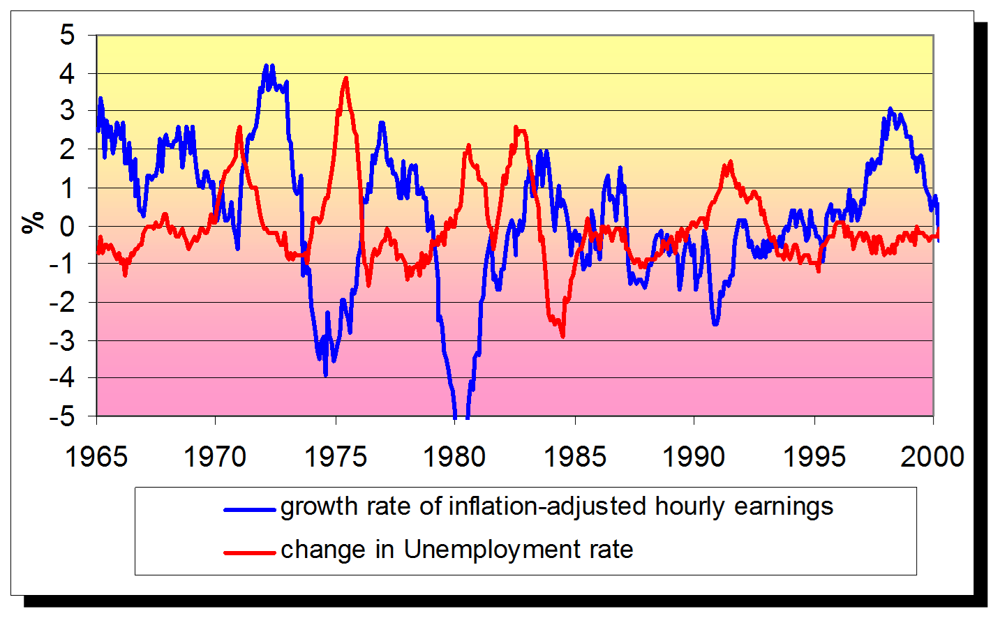

# 导论

## 一位学生的学习『体会』

你妹的宏观经济学，全是符号和公式；

你妹的宏观经济学，不写论文却考试；

你妹的宏观经济学，重点不知哪个是；

你妹的宏观经济学，解释还用英文字。

哎。。。

------------------------------------------------------------------------

## 问题：无处不在的宏观经济

You may not know it, but your everyday life is filled with macroeconomics in action.

日常直观的感受，物价水平总是在涨。现在的学费比起十年前高出不少，现在的面包比起十年前价格高出不少。为什么物价水平会不断地上涨？

六十年代末七十年代初出生的人都能感受到在1992-1996年之间寻找工作比2008年之后的年份要容易一些，社会的下岗工人也少一些，到底是哪些因素造成了这样的差别？为什么有的人会找不到工作？

是什么因素决定一个国家整体经济的福利的改变?为什么世界上有的国家非常富裕，而有的国家非常贫穷?是什么因素决定了不同国家收入的差异?

中国自改革开放以来，经济保持着持续增长的劲头，年均增长速度位于世界前列。是什么造成了中国经济的持续增长?

几乎每个中国人都感受到了生活水平相比我们的父辈有明显的提高，那么我们的下一代也能有比我们更优越的生活吗？

政府对经济衰退可以采取应对措施吗？应该采取措施吗？（美国7000亿美元救市、中国4万亿人民币投资刺激计划）

为什么各国央行经常要调整基准利率?

…...

宏观就在身边，它是如此生动，如此贴近我们的生活

------

## 数据：宏观与我们生活息息相关

- 宏观经济影响整个社会的福利水平。例如，失业和社会问题——失业率每增加1个百分点，将会引起:
  -   自杀人数增加920
  -    谋杀增加650起
  -    4000人 发生精神疾患
  -   3300人被关进监狱
  -    37,000 人死亡
  -    暴力事件和无家可归者增加\footnote{Barry Bluestone and Bennett Harrison, The Deindustrialization of America (New York:  Basic Books, 1982), Chapter 3}
- 宏观经济影响你本人的福利水平。例如，失业和收入增长
- 

